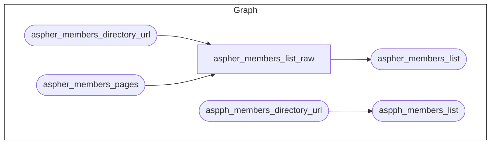
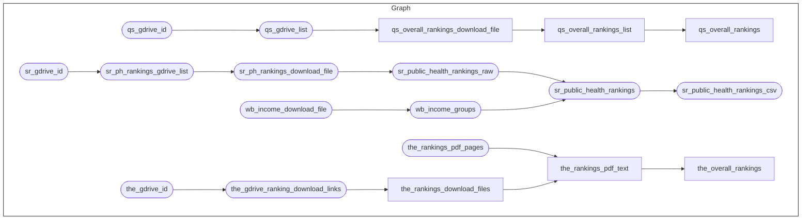

<!-- README.md is generated from README.Rmd. Please edit that file -->

# Review of Schools and Programmes of Public Health

<!-- badges: start -->

[](https://www.repostatus.org/#active)
[](https://github.com/OxfordIHTM/spph-review/actions/workflows/test-targets-workflow.yml)
[-GPL3.0-blue.svg)](https://opensource.org/licenses/gpl-3.0.html)
[-CC_BY_4.0-blue)](https://creativecommons.org/licenses/by/4.0/)
[-CC0-blue)](https://creativecommons.org/public-domain/cc0/)
<!-- badges: end -->

This repository is a template for a
[`docker`](https://www.docker.com/get-started)-containerised,
[`{targets}`](https://docs.ropensci.org/targets/)-based,
[`{renv}`](https://rstudio.github.io/renv/articles/renv.html)-enabled
[`R`](https://cran.r-project.org/) workflow for the **Review of Schools
and Programmes of Public Health project**.

## About the Project

## Repository Structure

The project repository is structured as follows:

    spph-review
        |-- .github/
        |-- data/
        |-- data-raw/
        |-- figures/
        |-- outputs/
        |-- R/
        |-- renv
        |-- reports
        |-- _targets_analysis.R
        |-- _targets_data.R
        |-- _targets_output.R
        |-- _targets_rag.R
        |-- _targets_release.R
        |-- _targets.R
        |-- .Rprofile
        |-- packages.R
        |-- renv.lock

  - `.github` contains project testing and automated deployment of
    outputs workflows via continuous integration and continuous
    deployment (CI/CD) using Github Actions.

  - `data/` contains intermediate and final data outputs produced by the
    workflow.

  - `data-raw/` contains raw datasets, usually either downloaded from
    source or added manually, that are used in the project.

  - `figures/` contains figures produced by the workflow.

  - `outputs/` contains compiled reports produced by the workflow.

  - `R/` contains functions developed/created specifically for use in
    this workflow.

  - `renv/` contains `renv` package specific files and directories used
    by the package for maintaining R package dependencies within the
    project. The directory `renv/library`, is a library that contains
    all packages currently used by the project. This directory, and all
    files and sub-directories within it, are all generated and managed
    by the `renv` package. Users should not change/edit these manually.

  - `reports/` contains literate code for R Markdown and/or Quarto
    reports rendered in the workflow.

  - `_targets*.R` files define the steps in the workflow’s data ingest,
    data processing, data analysis, and reporting pipelines.

  - `.Rprofile` file is a project R profile generated when initiating
    `renv` for the first time. This file is run automatically every time
    R is run within this project, and `renv` uses it to configure the R
    session to use the `renv` project library.

  - `packages.R` file lists out all R package dependencies required by
    the workflow.

  - `renv.lock` file is the `renv` lockfile which records enough
    metadata about every package used in this project that it can be
    re-installed on a new machine. This file is generated by the `renv`
    package and should not be changed/edited manually.

## Reproducibility

### System dependencies

This project requires the following system dependencies:

  - `poppler`

This project depends on the
[`{pdftools}`](https://poppler.freedesktop.org/) package which requires
the `poppler` PDF rendering library to be installed first. For macOS and
Windows users, installation of `{pdftools}` via the binary packages
available from CRAN will deal with this requirement automatically.
However, for Linux users, the `poppler` library will need to be
installed first in order to be able to install `{pdftools}` from source.
Installation of the `poppler` library for Linux is described
[here](https://docs.ropensci.org/pdftools/#installation).

  - `quarto`

This project uses the [`quarto`](https://quarto.org/) open-source
scientific and technical publishing system. Instructions on how to
download and install `quarto` can be found
[here](https://quarto.org/docs/get-started/).

  - `ollama`

This project uses `ollama` to serve open large language modles (LLM)
locally. Instructions on how to download and install `ollama` can be
found [here](https://ollama.com/download). This project specifically
uses the open source `DeepSeek-R1` model. Once `ollama` is installed,
pull one of the `DeepSeek-R1` models that fits into your local machine.
The workflow has been developed and implemented using the
`deepseek-r1:671b` model which requires about 404GB of random access
memory (RAM). We would recommend using the same model where possible or
if your machine has enough memory resources.

### R package dependencies

This project was built using `R 4.5.1`. This project uses the `renv`
framework to record R package dependencies and versions. Packages and
versions used are recorded in `renv.lock` and code used to manage
dependencies is in `renv/` and other files in the root project
directory. After cloning this repository, start an R session in the
project’s working directory and then run

``` r
renv::restore()
```

to install all R package dependencies.

### Running the workflow

Currently, the project has workflows for the following:

1.  Extraction, transformation, and loading (ETL) workflow for the
    [Association of Schools and Programs of Public Health
    (ASPPH)](https://aspph.org/) and [Association of Schools of Public
    Health in the European Region (ASPHER)](https://www.aspher.org/)
    members list.

The following diagram illustrates this pipeline.

Warning: program compiled against libxml 213 using older 209 +
aspher\_members\_list\_raw declared \[14 branches\]



To run this workflow, issue the following command on the R console:

``` r
targets::tar_make(dplyr::starts_with(c("aspph", "aspher")))
```

2.  Extraction, transformation, and loading (ETL) workflow for the
    [Times Higher Education (THE) university
    rankings](https://www.timeshighereducation.com/), [QS world
    university rankings](https://www.topuniversities.com/), and the
    [ShanghaiRanking](https://www.shanghairanking.com/) academic ranking
    of world universities.

The following diagram illustrates this pipeline.

Warning: program compiled against libxml 213 using older 209 +
the\_rankings\_download\_files declared \[5 branches\] +
qs\_overall\_rankings\_download\_file declared \[5 branches\] +
the\_rankings\_pdf\_text declared \[5 branches\] +
qs\_overall\_rankings\_list declared \[5 branches\] +
the\_overall\_rankings declared \[5 branches\] + qs\_overall\_rankings
declared \[5 branches\]



To run this workflow, issue the following command on the R console:

``` r
targets::tar_make(dplyr::starts_with(c("the", "qs", "sr")))
```

3.  Workflow for the creation of knowledge store of schools and
    programmes of public health for Retrieval augmentation generation
    (RAG)

The following diagram illustrates this pipeline.

Warning: program compiled against libxml 213 using older 209 +
emory\_master\_programme\_links declared \[2 branches\] +
ucla\_master\_programme\_links declared \[3 branches\] +
ph\_modules\_core\_category declared \[250 branches\] +
ph\_modules\_option\_category declared \[620 branches\]

``` mermaid
graph LR
  style Graph fill:#FFFFFF00,stroke:#000000;
  subgraph Graph
    direction LR
    x4fc8cf38fcd836da(["brist_master_programme_base_link"]):::uptodate --> x4ffc4b286e74b106(["brist_master_programme_links"]):::uptodate
    xd1b419dc21b137fd(["bsph_master_programme_base_link"]):::uptodate --> x9265149a2831ff64(["bsph_master_programme_links"]):::uptodate
    xc6e3140865f94fbc(["busph_master_programme_base_link"]):::uptodate --> x2136fcbf55496cab(["busph_master_programme_links"]):::uptodate
    xeaaa17530ab295dd(["dlsph_master_programme_base_link"]):::uptodate --> x2727c8fef021edde(["dlsph_master_programme_links"]):::uptodate
    x8de809c1ecd01ba1(["emory_master_programme_page"]):::uptodate --> x828ed7a4bd3f3d21["emory_master_programme_links"]:::uptodate
    x360f5685fc4bc9fb(["emory_master_programme_base_link"]):::uptodate --> x828ed7a4bd3f3d21["emory_master_programme_links"]:::uptodate
    xfccabf0142198819(["eras_master_programme_base_link"]):::uptodate --> x7f91187a7423bca1(["eras_master_programme_links"]):::uptodate
    xcc8516455460d0af(["gsph_master_programme_base_link"]):::uptodate --> x1e4a6fd3b8c0b563(["gsph_master_programme_links"]):::uptodate
    x4c0cf36d93e7e705(["hku_master_programme_base_link"]):::uptodate --> x115c3097f1a48e64(["hku_master_programme_links"]):::uptodate
    x8a53422a65f442e6(["hsph_master_programme_base_link"]):::uptodate --> x3c828a768d08b03c(["hsph_master_programme_links"]):::uptodate
    xfa0eb7e71dffb746(["karol_master_programme_base_link"]):::uptodate --> xa8ce1dff486c3fa9(["karol_master_programme_links"]):::uptodate
    x8d7fd7fdb58b45f5(["kcl_master_programme_base_link"]):::uptodate --> x612ae5ced287a482(["kcl_master_programme_links"]):::uptodate
    xd29f8a36f1f00289(["lshtm_gdrive_id"]):::uptodate --> xe4a88568d63f5f8a(["lshtm_master_programme_html_file"]):::uptodate
    x23bec5fed1b41fa6(["lshtm_master_programme_base_link"]):::uptodate --> x2bc43f2e04ac22c8(["lshtm_master_programme_links"]):::uptodate
    xe4a88568d63f5f8a(["lshtm_master_programme_html_file"]):::uptodate --> x2bc43f2e04ac22c8(["lshtm_master_programme_links"]):::uptodate
    x3109d2db975fa922(["mail_master_programme_base_link"]):::uptodate --> x1a41a51ab5210cc5(["mail_master_programme_links"]):::uptodate
    x16c7fb5e014309f5(["melb_master_programme_base_link"]):::uptodate --> xc5eb004ce5a0f56f(["melb_master_programme_links"]):::uptodate
    x5f951baab589cff4(["mich_gdrive_id"]):::uptodate --> x0d1e48120125e3a7(["mich_master_programme_html_file"]):::uptodate
    x0d1e48120125e3a7(["mich_master_programme_html_file"]):::uptodate --> xd50ae66e5e359cd0(["mich_master_programme_links"]):::uptodate
    x94d4c52ac8e5d10c(["mich_master_programme_base_link"]):::uptodate --> xd50ae66e5e359cd0(["mich_master_programme_links"]):::uptodate
    xb02800a1f2e0cece(["ph_review_data_expanded"]):::uptodate --> xe2dd634a8c093bab(["modules_core_expanded"]):::uptodate
    x1541b6e79f348f94(["ph_review_data_expanded_options"]):::uptodate --> xc5b7ec4bc2319a3f(["modules_option_expanded"]):::uptodate
    x59088797452b46b4(["ox_master_programme_base_link"]):::uptodate --> xd30cb6fd57d10bd4(["ox_master_programme_links"]):::uptodate
    x001f1d18a4407c5a(["ph_master_programme_list"]):::uptodate --> xa97b14abe598dc82(["ph_master_programme_links"]):::uptodate
    x4ffc4b286e74b106(["brist_master_programme_links"]):::uptodate --> x001f1d18a4407c5a(["ph_master_programme_list"]):::uptodate
    xd30cb6fd57d10bd4(["ox_master_programme_links"]):::uptodate --> x001f1d18a4407c5a(["ph_master_programme_list"]):::uptodate
    x9265149a2831ff64(["bsph_master_programme_links"]):::uptodate --> x001f1d18a4407c5a(["ph_master_programme_list"]):::uptodate
    x539fe7125dd4fbab(["queen_master_programme_links"]):::uptodate --> x001f1d18a4407c5a(["ph_master_programme_list"]):::uptodate
    x2136fcbf55496cab(["busph_master_programme_links"]):::uptodate --> x001f1d18a4407c5a(["ph_master_programme_list"]):::uptodate
    x20514717df1ea6b9(["imp_master_programme_links"]):::uptodate --> x001f1d18a4407c5a(["ph_master_programme_list"]):::uptodate
    x2727c8fef021edde(["dlsph_master_programme_links"]):::uptodate --> x001f1d18a4407c5a(["ph_master_programme_list"]):::uptodate
    xa8ce1dff486c3fa9(["karol_master_programme_links"]):::uptodate --> x001f1d18a4407c5a(["ph_master_programme_list"]):::uptodate
    x828ed7a4bd3f3d21["emory_master_programme_links"]:::uptodate --> x001f1d18a4407c5a(["ph_master_programme_list"]):::uptodate
    x612ae5ced287a482(["kcl_master_programme_links"]):::uptodate --> x001f1d18a4407c5a(["ph_master_programme_list"]):::uptodate
    xe32a54723b50e83a(["stan_master_programme_links"]):::uptodate --> x001f1d18a4407c5a(["ph_master_programme_list"]):::uptodate
    x7f91187a7423bca1(["eras_master_programme_links"]):::uptodate --> x001f1d18a4407c5a(["ph_master_programme_list"]):::uptodate
    xf8a25bd53511a35b(["sydn_master_programme_links"]):::uptodate --> x001f1d18a4407c5a(["ph_master_programme_list"]):::uptodate
    x1e4a6fd3b8c0b563(["gsph_master_programme_links"]):::uptodate --> x001f1d18a4407c5a(["ph_master_programme_list"]):::uptodate
    x38ca7d42df8061aa(["ubc_master_programme_links"]):::uptodate --> x001f1d18a4407c5a(["ph_master_programme_list"]):::uptodate
    x115c3097f1a48e64(["hku_master_programme_links"]):::uptodate --> x001f1d18a4407c5a(["ph_master_programme_list"]):::uptodate
    x2f5fb0bc5cf32d15(["ucl_master_programme_links"]):::uptodate --> x001f1d18a4407c5a(["ph_master_programme_list"]):::uptodate
    x3c828a768d08b03c(["hsph_master_programme_links"]):::uptodate --> x001f1d18a4407c5a(["ph_master_programme_list"]):::uptodate
    x3590313d9b5e3e18["ucla_master_programme_links"]:::uptodate --> x001f1d18a4407c5a(["ph_master_programme_list"]):::uptodate
    x83478a25351aecd3(["uott_master_programme_links"]):::uptodate --> x001f1d18a4407c5a(["ph_master_programme_list"]):::uptodate
    x286fd7a32eeae237(["wsph_master_programme_links"]):::uptodate --> x001f1d18a4407c5a(["ph_master_programme_list"]):::uptodate
    xd50ae66e5e359cd0(["mich_master_programme_links"]):::uptodate --> x001f1d18a4407c5a(["ph_master_programme_list"]):::uptodate
    xed4894dba5d96c12(["unsw_master_programme_links"]):::uptodate --> x001f1d18a4407c5a(["ph_master_programme_list"]):::uptodate
    xa518d7e4a5a3b466(["ysph_master_programme_links"]):::uptodate --> x001f1d18a4407c5a(["ph_master_programme_list"]):::uptodate
    x1a41a51ab5210cc5(["mail_master_programme_links"]):::uptodate --> x001f1d18a4407c5a(["ph_master_programme_list"]):::uptodate
    x25d0550b1aade5fc(["upen_master_programme_links"]):::uptodate --> x001f1d18a4407c5a(["ph_master_programme_list"]):::uptodate
    x2bc43f2e04ac22c8(["lshtm_master_programme_links"]):::uptodate --> x001f1d18a4407c5a(["ph_master_programme_list"]):::uptodate
    x6e23dd9e1d84da78(["usp_master_programme_links"]):::uptodate --> x001f1d18a4407c5a(["ph_master_programme_list"]):::uptodate
    xc5eb004ce5a0f56f(["melb_master_programme_links"]):::uptodate --> x001f1d18a4407c5a(["ph_master_programme_list"]):::uptodate
    xfa5eba42b9e1828b(["ucsf_master_programme_links"]):::uptodate --> x001f1d18a4407c5a(["ph_master_programme_list"]):::uptodate
    x001f1d18a4407c5a(["ph_master_programme_list"]):::uptodate --> x2c5ad34e3d0cd2e8(["ph_master_programme_list_csv"]):::uptodate
    xe2dd634a8c093bab(["modules_core_expanded"]):::uptodate --> x47962afd33e90545["ph_modules_core_category"]:::outdated
    x05d83435826f8e6b(["module_categories"]):::uptodate --> x47962afd33e90545["ph_modules_core_category"]:::outdated
    xfc2a1b8d35ffe38f(["ph_analysis_model"]):::outdated --> x47962afd33e90545["ph_modules_core_category"]:::outdated
    x32dd16c1fab5bebf(["module_options_categories"]):::uptodate --> xa808a822d9389ef4["ph_modules_option_category"]:::outdated
    xc5b7ec4bc2319a3f(["modules_option_expanded"]):::uptodate --> xa808a822d9389ef4["ph_modules_option_category"]:::outdated
    xfc2a1b8d35ffe38f(["ph_analysis_model"]):::outdated --> xa808a822d9389ef4["ph_modules_option_category"]:::outdated
    xf0fee9d2b37a3827(["review_gdrive_id"]):::uptodate --> xe6494c691f0de688(["ph_review_data"]):::uptodate
    xe6494c691f0de688(["ph_review_data"]):::uptodate --> xb02800a1f2e0cece(["ph_review_data_expanded"]):::uptodate
    xe6494c691f0de688(["ph_review_data"]):::uptodate --> x1541b6e79f348f94(["ph_review_data_expanded_options"]):::uptodate
    xa808a822d9389ef4["ph_modules_option_category"]:::outdated --> x3573746531b63d9d(["ph_review_data_processed"]):::outdated
    xa7027837a89e5ec4(["sr_public_health_rankings"]):::uptodate --> x3573746531b63d9d(["ph_review_data_processed"]):::outdated
    xe6494c691f0de688(["ph_review_data"]):::uptodate --> x3573746531b63d9d(["ph_review_data_processed"]):::outdated
    x47962afd33e90545["ph_modules_core_category"]:::outdated --> x3573746531b63d9d(["ph_review_data_processed"]):::outdated
    x3573746531b63d9d(["ph_review_data_processed"]):::outdated --> x2e27caf1c7d9ed2d(["ph_review_data_processed_csv"]):::outdated
    xde0dc4c4ce3aaef2(["ph_review_data_release_file"]):::outdated --> xa04cc092ddf50c86(["ph_review_data_released"]):::outdated
    x81e999888dc40458(["queen_master_programme_base_link"]):::uptodate --> x539fe7125dd4fbab(["queen_master_programme_links"]):::uptodate
    x283ab20454910291(["sr_ph_rankings_gdrive_list"]):::uptodate --> xe2fef9f751519f5f(["sr_ph_rankings_download_file"]):::uptodate
    xf9bf18a76745f614(["sr_gdrive_id"]):::uptodate --> x283ab20454910291(["sr_ph_rankings_gdrive_list"]):::uptodate
    x1a5851e4bb9a8b0f(["wb_income_groups"]):::uptodate --> xa7027837a89e5ec4(["sr_public_health_rankings"]):::uptodate
    x74232ff4e76c1dcf(["sr_public_health_rankings_raw"]):::uptodate --> xa7027837a89e5ec4(["sr_public_health_rankings"]):::uptodate
    xe2fef9f751519f5f(["sr_ph_rankings_download_file"]):::uptodate --> x74232ff4e76c1dcf(["sr_public_health_rankings_raw"]):::uptodate
    xb254816e804e5084(["sydn_master_programme_base_link"]):::uptodate --> xf8a25bd53511a35b(["sydn_master_programme_links"]):::uptodate
    xf91860885f797869(["ubc_master_programme_base_link"]):::uptodate --> x38ca7d42df8061aa(["ubc_master_programme_links"]):::uptodate
    x20c4e09e9a980e50(["ucl_master_programme_base_link"]):::uptodate --> x2f5fb0bc5cf32d15(["ucl_master_programme_links"]):::uptodate
    x10349c6a49f7c789(["ucla_master_programme_base_link"]):::uptodate --> x3590313d9b5e3e18["ucla_master_programme_links"]:::uptodate
    x5fae802164025394(["ucla_master_programme_page"]):::uptodate --> x3590313d9b5e3e18["ucla_master_programme_links"]:::uptodate
    x46e6c6b00df5ee8d(["ucsf_master_programme_base_link"]):::uptodate --> xfa5eba42b9e1828b(["ucsf_master_programme_links"]):::uptodate
    x500af41fd1eff9cb(["upen_master_programme_base_link"]):::uptodate --> x25d0550b1aade5fc(["upen_master_programme_links"]):::uptodate
    x7efdd5d00ac0ac99(["usp_gdrive_id"]):::uptodate --> xad36e534977318df(["usp_master_programme_html_file"]):::uptodate
    xad36e534977318df(["usp_master_programme_html_file"]):::uptodate --> x6e23dd9e1d84da78(["usp_master_programme_links"]):::uptodate
    xaec0c0b2c134d0a5(["usp_master_programme_base_link"]):::uptodate --> x6e23dd9e1d84da78(["usp_master_programme_links"]):::uptodate
    x578811b318f92d03(["wb_income_download_file"]):::uptodate --> x1a5851e4bb9a8b0f(["wb_income_groups"]):::uptodate
    xb2261587e1ed3d71(["wsph_master_programme_base_link"]):::uptodate --> x286fd7a32eeae237(["wsph_master_programme_links"]):::uptodate
    xfad01d76630fd18c(["ysph_master_programme_base_link"]):::uptodate --> xa518d7e4a5a3b466(["ysph_master_programme_links"]):::uptodate
    
  end
```



To run this workflow, issue the following command on the R console:

``` r
targets::tar_make(
  dplyr::contains("ph_master_programme", "ph_review_data")
)
```

## Authors

  - Proochista Ariana
  - Ernest Guevarra

## License

All code in this project is released under a
[GPL-3.0](https://www.gnu.org/licenses/gpl-3.0.en.html#license-text)
license. All text in this project is released under a
[CC-BY-4.0](https://creativecommons.org/licenses/by/4.0/deed.en)
license. All data is released under a
[CC0](https://creativecommons.org/public-domain/cc0/) license.
